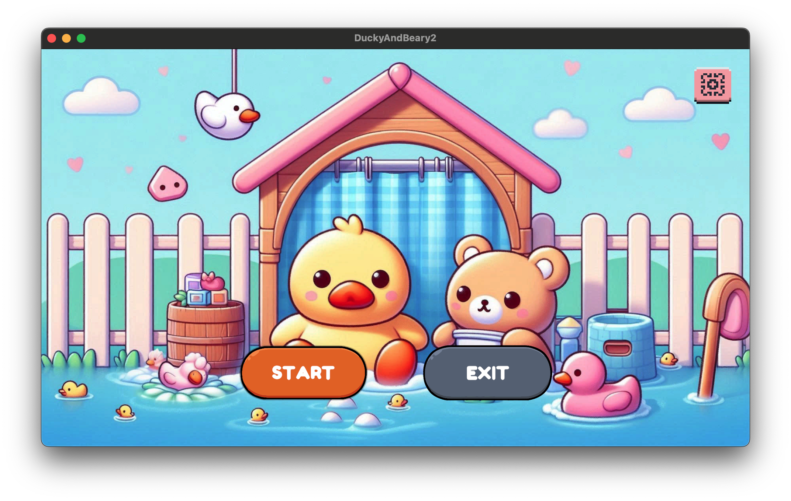
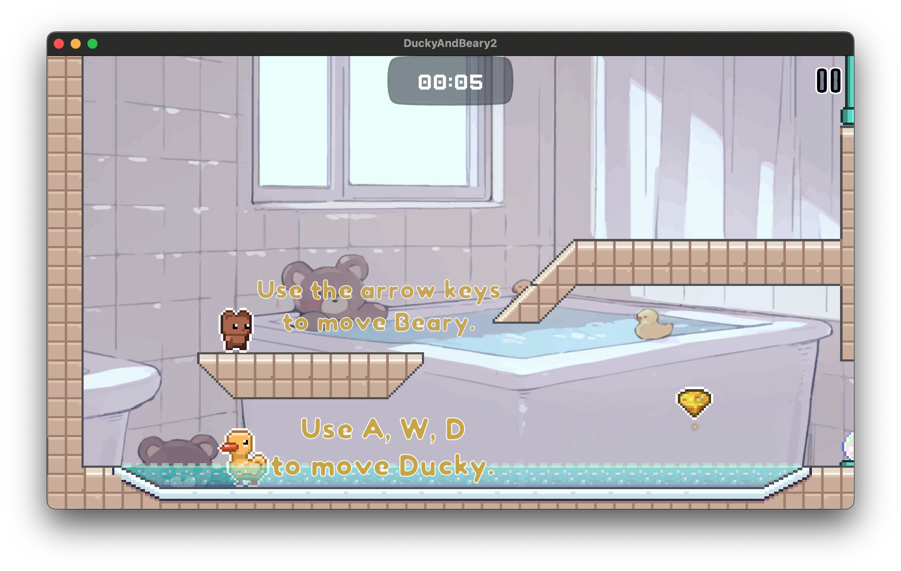
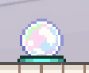
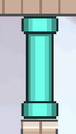
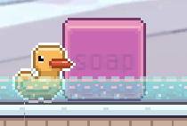
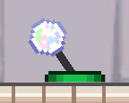
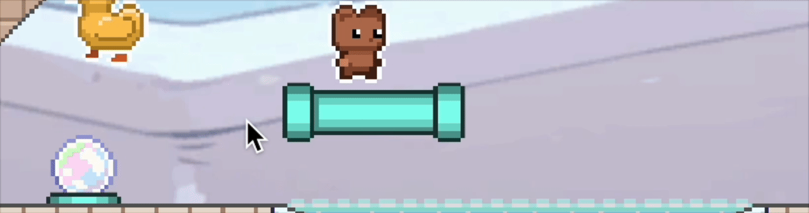
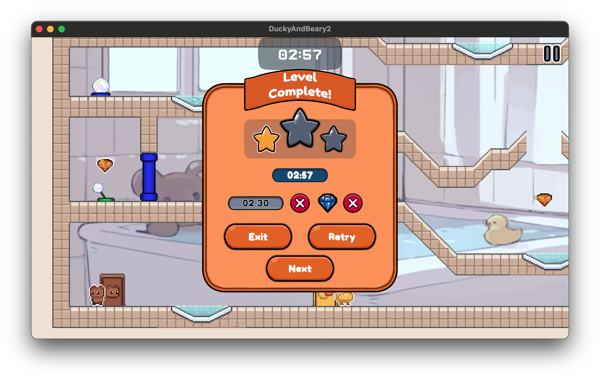
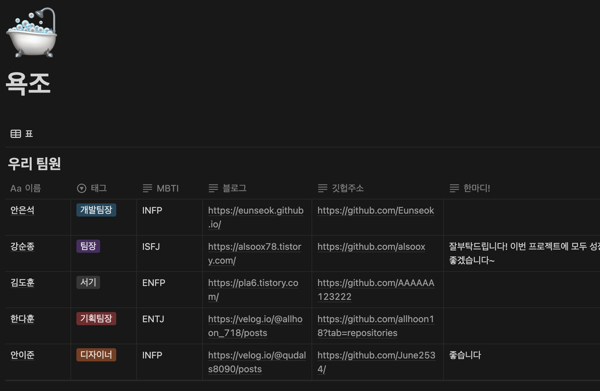

# Ducky & Beary

## 1. 게임 개요
**Ducky & Beary**는 장난감 오리(Ducky)와 곰인형(Beary)이 욕실을 배경으로 다양한 퍼즐을 풀며 출구를 찾아가는 2D 플랫포머 퍼즐 게임입니다. 플레이어는 두 캐릭터의 특성을 활용하여 장애물을 극복하고 목표 지점까지 도달해야 합니다.

[플레이영상]

<video src="Images/README/PlayVideo.mp4"></video>

---

## 2. 게임 소개
- **주인공**: 장난감 오리(Ducky)와 곰인형(Beary)
- **배경 스토리**: 어느 날 밤, 장난감들이 욕실에서 깨어났습니다. 물을 무서워하는 곰인형 Beary와 물에서 자유롭게 움직이는 오리 Ducky는 힘을 합쳐 탈출을 시도합니다. 하지만 욕실에는 다양한 장애물이 있어 협력 없이는 빠져나갈 수 없습니다!
- **목표**: 서로 협력하여 장애물을 넘고, 출구를 찾아 다음 스테이지로 이동하는 것

---

## 3. 게임 장르 및 플랫폼
- **장르**: 2D 플랫포머 퍼즐 게임
- **플랫폼**: PC (Windows, Mac 지원 예정)
- **조작 방식**: 키보드 및 마우스 조작

---

## 4. 게임 특징
### 4.1 캐릭터 특성
- **Ducky (오리)**
  - 물 위를 자유롭게 이동 가능
  - 특정 발판을 밀거나 당겨서 곰인형이 지나갈 길을 만들 수 있음
  - 레버를 작동하여 새로운 길을 열 수 있음
  
- **Beary (곰인형)**
  - 물에 닿으면 게임 오버
  - 점프하여 장애물을 넘을 수 있음
  - Ducky가 의 도움을 받아 이동해야 함
  

### 4.2 퍼즐 요소
- 욕실 내 다양한 장애물과 상호작용 요소 포함
  - **움직이는 발판**: 레버나 버튼을 눌러 특정 발판을 움직일 수 있음
  - **버튼 퍼즐**: 특정 버튼을 동시에 눌러야 문이 열리는 구조
  - **비누**: 밀거나 당겨 발판역할을 하거나 버튼을 누르는 용도

          

---

## 5. 조작법
| 캐릭터             | 조작 키                              |
| ------------------ | ------------------------------------ |
| **Ducky (오리)**   | W (점프), A (좌 이동), S (특정 행동) |
| **Beary (곰인형)** | 방향키 ←, → (좌우 이동), ↑ (점프)    |
| **UI 요소**        | 마우스 클릭을 통해 사용              |

---

## 6. 게임 목표
- 협력하여 스테이지의 출구를 찾고 탈출하기
- 점점 더 어려워지는 퍼즐을 해결하며 두 캐릭터의 협력을 극대화하기
- 제한된 환경 속에서 최적의 이동 경로를 찾아 해결하는 것이 핵심

---

## 7. 게임 개발 및 배포 계획
- **개발 엔진**: Unity
- **출시 예정 플랫폼**: WebGL (itch.io 배포), 추후 스팀 출시 고려
- **데이터 저장**: Firebase Realtime Database를 활용한 클라우드 저장 시스템 추가 예정
- **멀티플레이어 여부**: 초기 버전은 싱글플레이, 향후 2인 협력 모드 추가 예정

---

## 8. 추가 예정 기능
- 더 다양한 장애물과 기믹 추가 (예: 비눗방울, 미끄러운 바닥)
- 곰인형과 오리의 외형 커스터마이징
- 난이도 선택 기능

---

## 9. 팀 소개
